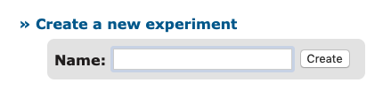
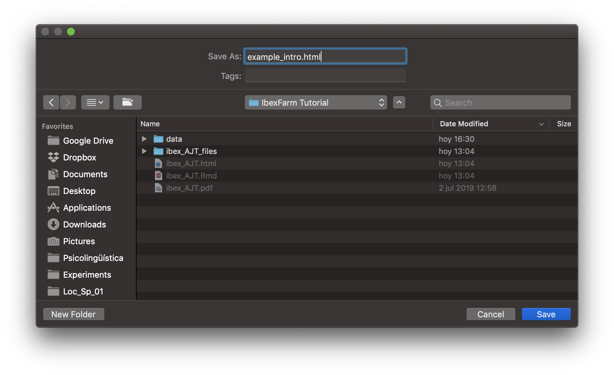

When we access IbexFarm for the first time, we need to create a new experiment and come up with a name for it. Note that the name we choose is the name participants will see in the URL, so choose a name that does not give away too much information.

Within our experiment, there are many files grouped in different sections:

* **chunk_includes**: Includes the HTML file participants see when they open the experiment's link. Here we also include some questions to gather data from our participants (age, native language, etc.).
* **css_includes**: 
* **data_includes**: Includes the file containing the experimental sentences.
* **js_includes**: 
* **results**: When results are sent to the server, two files will appear here: "raw_results" and "results".
* **server_state**: Counter.

The files we must modify are included in **chunk_includes** (example_intro.html) and **data_includes** (example_data.js). These files are HTML and JavaScript, respectively. Even though IbexFarm includes an online editor, I recommend using a third part editor because IbexFarm does not support UTF-8, i.e. special characters like accents, *ñ*, or initial question marks (*¿*) will not be displayed. Please install [Sublime Text 3](https://www.sublimetext.com/3).

## Intro file (example_intro.html)

The intro file is the first thing participants see when they access the experiment. We should include:

* A welcome message.
* Instructions (with an example).
* Questions to gather information about participants.
* Thank you message.

The intro file is an HTML file, so basic HTML coding is required. If you have never coded in HTML before, don't panic -you'll only need very basic commands and Google is always willing to help.

Open Sublime Text 3.0 and open a new file (File > New File). Name it "example_intro.html" and save it in your computer.

In HTML, paragraphs are inserted between `
 
`. For instance:

`
Thank you for taking part in our experiment!
`