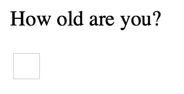
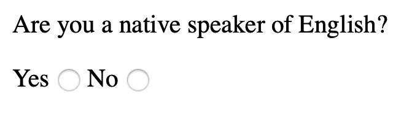
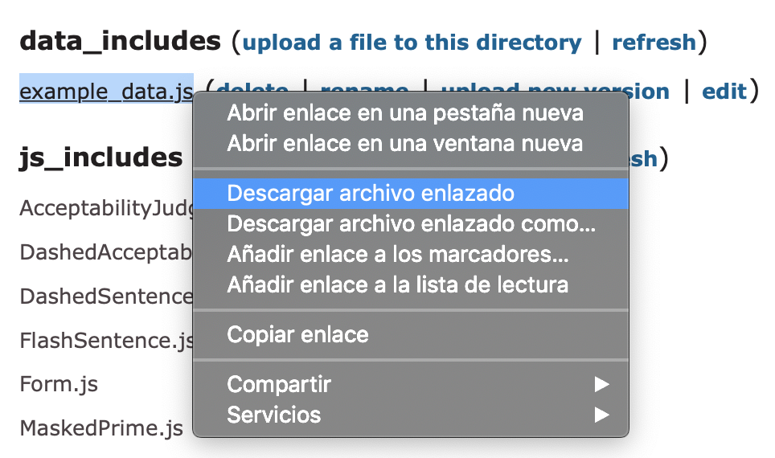
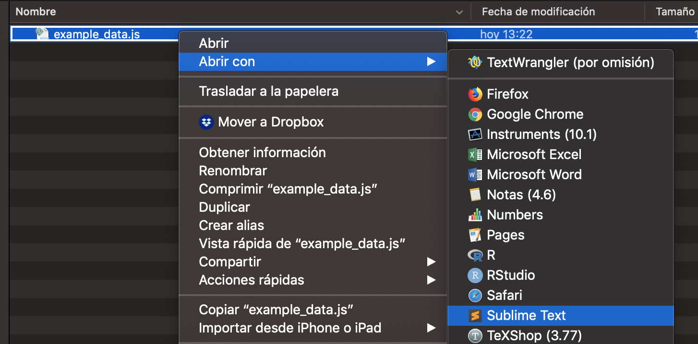
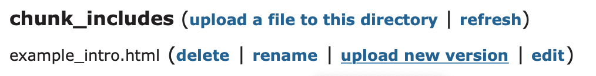

This section will cover how to create a simple acceptability judgment task (AJT) with IbexFarm. If you'd like to customize your experiment -or combine different types of experiments, e.g. a self-paced reading and an AJT- read the <a href="http://spellout.net/latest_ibex_manual.pdf" target="_blank">IbexFarm 0.3.8 Manual</a>.

## Getting started

First, go to <a href="http://spellout.net/ibexfarm/" target="_blank">http://spellout.net/ibexfarm/</a>. When we access IbexFarm for the first time, we need to create a new experiment and come up with a name for it. Note that the name we choose is the name participants will see in the URL, so choose a name that does not give away too much information.

{ width=50% }

Within our experiment, there are many files grouped in different sections:

* **chunk_includes**: Includes the HTML file participants see when they open the experiment's link. Here we also include some questions to gather data from our participants (age, native language, etc.).
* **css_includes**
* **data_includes**: Includes the file containing the experimental sentences.
* **js_includes**
* **results**: When results are sent to the server, two files will appear here: "raw_results" and "results".
* **server_state**: Counter.

The files we must modify are included in **chunk_includes** (example_intro.html) and **data_includes** (example_data.js). These files are HTML and JavaScript, respectively. Even though IbexFarm includes an online editor, I recommend using a third-party editor because IbexFarm does not support UTF-8, i.e. special characters like accents, *ñ*, or initial question marks (*¿*) will not be displayed. Please install [Sublime Text 3](https://www.sublimetext.com/3).

## Intro file

The intro file is the first thing participants see when they access the experiment. We should include:

* A welcome message.
* Instructions (with an example).
* Questions to gather information about participants.
* Thank you message.

The intro file is an HTML file, so basic HTML coding is required. If you have never coded in HTML before, don't panic -you'll only need very basic commands and Google is always willing to help!

Open Sublime Text 3.0 and open a new file (File > New File). Name it "example_intro.html" and save it to your computer.


In HTML, paragraphs are inserted between `<p> </p>`. For instance:

```
<p>Thank you for taking part in our experiment!</p>
```

In principle, we can ask two types of questions: open questions or multiple choice questions. Imagine we want to know how old our participants are. We would need the following code:

```
<p>How old are you?</p>

<input name="age" type="text" class="obligatory" size="2"/>
```

The result will be:

{ width=17% }

Now imagine we want to know whether our participant is a native speaker of English.

```
<p>Are you a native speaker of English?</p>

Yes
<input name="native" type="radio" class="obligatory" value="Yes"/>
No
<input name="native" type="radio" class="obligatory" value="No"/>
```

The result will be:

{ width=30% }

## Data file

The file containing the experimental and filler sentences is "example_data.js". Note that this is JavaScript file. However, an example is provided when we create a new experiment in IbexFarm, so only minimal adjustments are needed, i.e. it's not really necessary to know JavaScript.

Go to your experiment in IbexFarm, right click on "example_data.js" and then save it to your computer.

{ width=60% }

Right click on the file and open it with Sublime Text 3.0:

{ width=80% }

### Items

The most important part of the data file is the "items" section:

```
var items = [

["intro", "Form", {
    html: { include: "example_intro.html" },
    validators: {
        age: function (s) { if (s.match(/^\d+$/)) return true; else return "Bad value for \u2018age\u2019"; }
        }
    } ],

// YOUR ITEMS GO HERE

]; //
```

The first thing we see is `"intro"`. This is our welcome page for our experiment, i.e. the HTML file we created before (example_intro.html). Within `validators`, we can set a customize error message if a wrong answer is provided in the form. We had already set obligatory fields in our HTML file, but we can customize the `age` error message in case a participant introduces text instead of numbers:

```
var items = [

["intro", "Form", {
    html: { include: "example_intro.html" },
    validators: {
        age: function (s) { if (s.match(/^\d+$/)) return true; else return "Valor erróneo para \u2018edad\u2019"; }
        }
    } ],

// YOUR ITEMS GO HERE

]; //
```

Each item is coded as follows:

```
[["CONDITION",ITEM_NUMBER],"AcceptabilityJudgment",{s:"SENTENCE"}],
```

Imagine we want to investigate how acceptable subject and object relatives are in Spanish. Our first item would look as follows:

```
[["subj_rel",1],"AcceptabilityJudgment",{s:"Conocían al atleta que venció finalmente al corredor el año pasado."}],
[["obj_rel",1],"AcceptabilityJudgment",{s:"Conocían al atleta que venció finalmente el corredor el año pasado."}],
```

In (psycho)linguistics, we create different versions of a sentence depending on the manipulation(s) we are interested in. This is what we call an *item*. In our example above, we are manipulating the type of relative clause, which can be either subject or object. That is, we have an experimental design with one factor (TYPE OF RELATIVE CLAUSE) with two levels: "subject" or "object" relative. Thus, our first item consists of two sentences which **only** differ in our experimental manipulation, whereas all other features remain the same.

1. *Subject relative*: Conocían al atleta que venció finalmente <u>al</u> corredor el año pasado.
1. *Object relative*: Conocían al atleta que venció finalmente <u>el</u> corredor el año pasado.

However, we don't want participants to see the same item twice to avoid repetition effects, i.e. we don't want them two see all the different versions of an item. We want them to see just one token of each item. This is known as a Latin square design. This can be easily implemented in IbexFarm by setting the same item number to each of the different tokens of the same item. IbexFarm will automatically pick one of them for a participant, and will pick the other one when the next participant is doing the experiment.

When we have more items, it's a good idea to group them by condition and insert a comment in our script to remember how we grouped them. Comments can be inserted after `//`. This is what our items section should look like:

```
var items = [

["intro", "Form", {
    html: { include: "example_intro.html" },
    validators: {
        age: function (s) { if (s.match(/^\d+$/)) return true; else return "Valor erróneo para \u2018edad\u2019"; }
        }
    } ],

// Subject relatives

[["subj_rel",1],"AcceptabilityJudgment",{s:"Conocían al atleta que venció finalmente al corredor el año pasado."}],
[["subj_rel",2],"AcceptabilityJudgment",{s:"Investigaron al testigo que señalaba claramente al asesino durante el juicio."}],
[["subj_rel",3],"AcceptabilityJudgment",{s:"Aplaudieron al actor que llevó ese año al director a los Óscars."}],
[["subj_rel",4],"AcceptabilityJudgment",{s:"Censuraron el programa que denunció duramente al político a través de la radio."}],

// Object relatives

[["obj_rel",1],"AcceptabilityJudgment",{s:"Conocían al atleta que venció finalmente el corredor el año pasado."}],
[["obj_rel",2],"AcceptabilityJudgment",{s:"Investigaron al testigo que señalaba claramente al asesino durante el juicio."}],
[["obj_rel",3],"AcceptabilityJudgment",{s:"Aplaudieron al actor que llevó ese año el director a los Óscars."}],
[["obj_rel",4],"AcceptabilityJudgment",{s:"Censuraron el programa que denunció duramente el político a través de la radio."}],

]; //
```

With this code, participant 1 will see, for example, the "subj_rel" version of item 1, the "obj_rel" version of item 2, and so on; whereas participant 2 will see the "obj_rel" version of item 1, the "subj_rel" version of item 2, etc.

Filler items don't need to be numbered. It's a good idea to code grammatical and ungrammatical fillers differently so we can then see the ratings participants have given to them as a sanity check. We can also include some practice items at the beginning so participants get used to the task. Since we won't assign item numbers to our fillers and practice items, their format is the following:

```
["TYPE","AcceptabilityJudgment",{s:"SENTENCE"}],
```

Our code including practice items and fillers looks as follows:

```
var items = [

["intro", "Form", {
    html: { include: "example_intro.html" },
    validators: {
        age: function (s) { if (s.match(/^\d+$/)) return true; else return "Valor erróneo para \u2018edad\u2019"; }
        }
    } ],

// Practice

["practice","AcceptabilityJudgment",{s:"La casa de Luis está lejos del centro de la ciudad."}],
["practice","AcceptabilityJudgment",{s:"Los vecinos vieron que el cristal de la puerta estaba rota."}],

// Subject relatives

[["subj_rel",1],"AcceptabilityJudgment",{s:"Conocían al atleta que venció finalmente al corredor el año pasado."}],
[["subj_rel",2],"AcceptabilityJudgment",{s:"Investigaron al testigo que señalaba claramente al asesino durante el juicio."}],
[["subj_rel",3],"AcceptabilityJudgment",{s:"Aplaudieron al actor que llevó ese año al director a los Óscars."}],
[["subj_rel",4],"AcceptabilityJudgment",{s:"Censuraron el programa que denunció duramente al político a través de la radio."}],

// Object relatives

[["obj_rel",1],"AcceptabilityJudgment",{s:"Conocían al atleta que venció finalmente el corredor el año pasado."}],
[["obj_rel",2],"AcceptabilityJudgment",{s:"Investigaron al testigo que señalaba claramente al asesino durante el juicio."}],
[["obj_rel",3],"AcceptabilityJudgment",{s:"Aplaudieron al actor que llevó ese año el director a los Óscars."}],
[["obj_rel",4],"AcceptabilityJudgment",{s:"Censuraron el programa que denunció duramente el político a través de la radio."}],

// Fillers

["filler_gram","AcceptabilityJudgment",{s:"La frutera ha preguntado a la clienta si necesita una bolsa de plástico."}],
["filler_gram","AcceptabilityJudgment",{s:"Vieron que la abogada había manipulado las pruebas deliberadamente para ganar el caso"}],
["filler_ungram","AcceptabilityJudgment",{s:"El explorador estaba atento por si salías un animal salvaje de la selva."}],
["filler_ungram","AcceptabilityJudgment",{s:"Denunciaron que la futbolista había sido sancionado de forma injusta en la final."}],

]; //
```

### Settings

Now that we have our items, we can go back to the beginning of the JavaScript file. With `var shuffleSequence`we can determine the order of participants

```
var shuffleSequence = seq("intro", randomize("practice"), 
shuffle(randomize(anyOf("subj_rel","obj_rel")), 
randomize(anyOf("filler_gram","filler_ungram"))));
```

The code above establishes that the first thing participants will see is the HTML intro page we've created before, then all practice items, and then experimental and filler items randomly.

By default, all messages/information are in English. However, we can translate these messages into any language we want. These are the variables we need to include if we want to translate these messages into Spanish:

```
var sendingResultsMessage = "Los resultados se están enviando al servidor.";
var completionMessage = "Los resultados se han enviado al servidor. ¡Muchas gracias!";
var progressBarText = "Barra de progreso";
var pageTitle = "Experimento";
````

Within `var defaults`we can further customize our experiment. In `"AcceptabilityJudgment"`, we can adjust the Likert scale we would like to use and translate the instructions:

```
"AcceptabilityJudgment", {
    as: ["1", "2", "3", "4", "5", "6", "7"],
    presentAsScale: true,
    instructions: "Pulsa el número en el teclado o haz clic sobre la puntuación que quieras darle a la oración.",
    leftComment: "Inaceptable", rightComment: "Aceptable"
},
```

We can change the default "Click here to continue" message we see at the bottom of our intro file in `"Form"`:

```
"Form", {
    hideProgressBar: true,
    continueOnReturn: true,
    saveReactionTime: true,
    continueMessage: "Haz clic aquí para continuar"
    }
```

This is all we need to get our experiment going. Your final "example_data.js" file should look like this:

```
var shuffleSequence = seq("intro", randomize("practice"), shuffle(randomize(anyOf("subj_rel","obj_rel")), randomize(anyOf("filler_gram","filler_ungram"))));

var sendingResultsMessage = "Los resultados se están enviando al servidor.";
var completionMessage = "Los resultados se han enviado al servidor. ¡Muchas gracias!";
var progressBarText = "Barra de progreso";
var pageTitle = "Experimento";

var defaults = [
  "AcceptabilityJudgment", {
      as: ["1", "2", "3", "4", "5", "6", "7"],
      presentAsScale: true,
      instructions: "Pulsa el número en el teclado o haz clic sobre la puntuación que quieras darle a la oración.",
      leftComment: "Inaceptable", rightComment: "Aceptable"
  },

  "Form", {
      hideProgressBar: true,
      continueOnReturn: true,
      saveReactionTime: true,
      continueMessage: "Haz clic aquí para continuar"
    }
];

var items = [

["intro", "Form", {
    html: { include: "example_intro.html" },
    validators: {
        age: function (s) { if (s.match(/^\d+$/)) return true; else return "Valor erróneo para \u2018edad\u2019"; }
        }
    } ],

// Practice

["practice","AcceptabilityJudgment",{s:"La casa de Luis está lejos del centro de la ciudad."}],
["practice","AcceptabilityJudgment",{s:"Los vecinos vieron que el cristal de la puerta estaba rota."}],

// Subject relatives

[["subj_rel",1],"AcceptabilityJudgment",{s:"Conocían al atleta que venció finalmente al corredor el año pasado."}],
[["subj_rel",2],"AcceptabilityJudgment",{s:"Investigaron al testigo que señalaba claramente al asesino durante el juicio."}],
[["subj_rel",3],"AcceptabilityJudgment",{s:"Aplaudieron al actor que llevó ese año al director a los Óscars."}],
[["subj_rel",4],"AcceptabilityJudgment",{s:"Censuraron el programa que denunció duramente al político a través de la radio."}],

// Object relatives

[["obj_rel",1],"AcceptabilityJudgment",{s:"Conocían al atleta que venció finalmente el corredor el año pasado."}],
[["obj_rel",2],"AcceptabilityJudgment",{s:"Investigaron al testigo que señalaba claramente al asesino durante el juicio."}],
[["obj_rel",3],"AcceptabilityJudgment",{s:"Aplaudieron al actor que llevó ese año el director a los Óscars."}],
[["obj_rel",4],"AcceptabilityJudgment",{s:"Censuraron el programa que denunció duramente el político a través de la radio."}],

// Fillers

["filler_gram","AcceptabilityJudgment",{s:"La frutera ha preguntado a la clienta si necesita una bolsa de plástico."}],
["filler_gram","AcceptabilityJudgment",{s:"Vieron que la abogada había manipulado las pruebas deliberadamente para ganar el caso"}],
["filler_ungram","AcceptabilityJudgment",{s:"El explorador estaba atento por si salías un animal salvaje de la selva."}],
["filler_ungram","AcceptabilityJudgment",{s:"Denunciaron que la futbolista había sido sancionado de forma injusta en la final."}],

]; //
```

## Upload your files

Now that we have the HTML and the JavaScript files we need, we have to upload them to our experiment in IbexFarm. Go to your experiment and find the "example_intro.html" file. Click on "Upload new version" and select the HTML you have created. Do the same with the "example_data.js" file.

{ width=60% }

Your experiment is ready! Click on the link at the top of the page, which has the following format: http://spellout.net/ibexexps/USER_NAME/EXPERIMENT_NAME/experiment.html. You should now see the HTML intro file. If you get an error message, check your JavaScript file for missing commas, semicolons and brackets (or save time and use an <a href="https://esprima.org/demo/validate.html" target="_blank">online syntax validator</a> to know where the error is!). 


